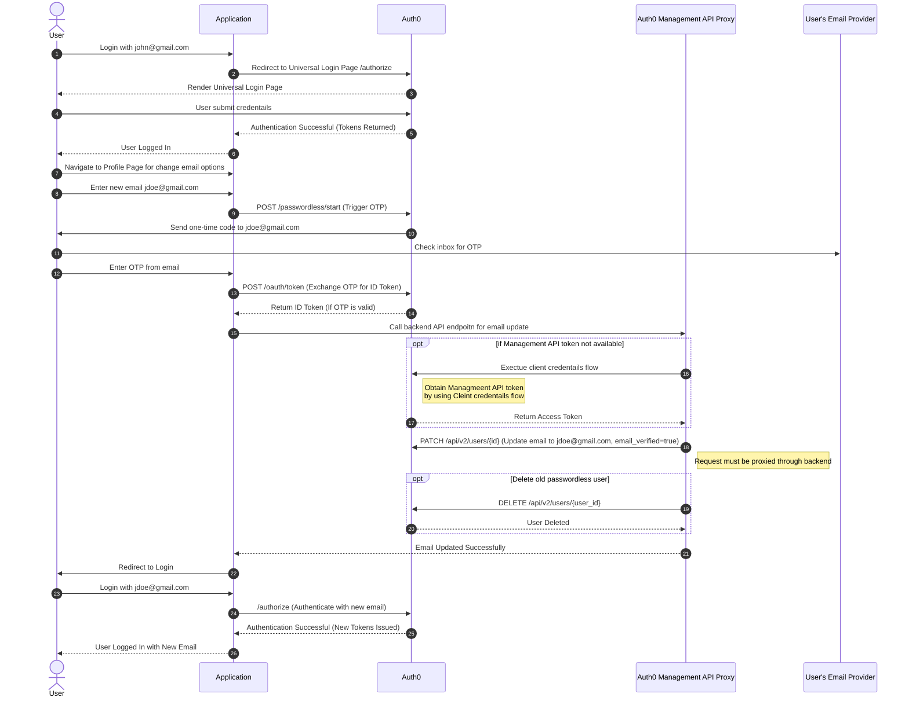
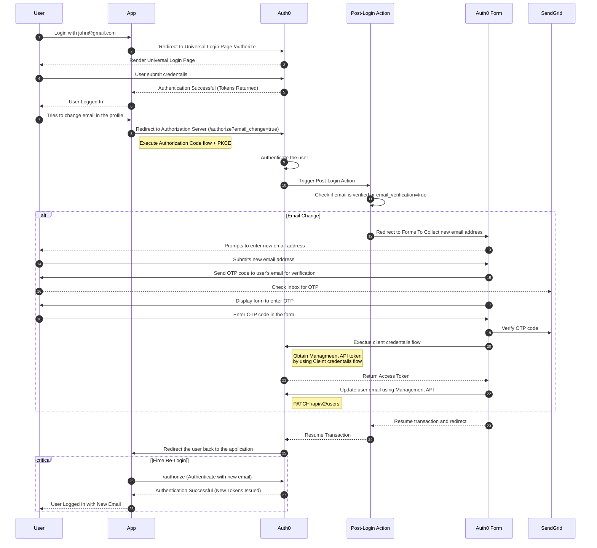

# Change User Email 

By default, the Auth0 Management API allows updating a user's email address for identities stored in Database or Custom Database Connections. However, this API immediately updates the email address without requiring prior verification. While basic email validation is performed, there is no built-in mechanism to verify the new email before applying the change.

Using the Management API without proper security controls can lead to potential risks. For instance, a typo in the email address could lock a user out of their account, especially if the mistake goes unnoticed before the session expires. In a worst-case scenario, an incorrectly entered email could unintentionally grant access to another individual, leading to account takeover risks. Therefore, implementing additional validation and verification steps before committing an email change is critical to ensuring account security.

### Option 1: Change User Email Address  from Profile Page 

This flow uses Application profile page to collect the user's new email address and verifies it via the Auth0 Passwordless api before updating the email in Auth0.

The following sequence diagram highlights the flow 

* User logs in with john@gmail.com.
* App redirects to Auth0’s Universal Login Page (/authorize).
* User submits credentials, and Auth0 returns authentication tokens.
* User navigates to the profile page to change email.
* User enters a new email: jdoe@gmail.com.
* App requests Auth0 to send an OTP to the new email.
* User enters the OTP in the app.
* App exchanges OTP for an ID token with Auth0.
* App updates the email via Auth0 Management API.
* Auth0 updates the user's email and marks it as verified.
    * (Optional) Old passwordless user account is deleted.
* App confirms the email update and redirects the user to log in again.
* User logs in with the new email.
* Auth0 verifies credentials and issues new authentication tokens.
* App confirms successful login with the new email.

Considerations
* A new profile will be created in the email passwordless connection
* The email passwordless “login” flow is considered a monthly active user (MAU)
* The email passwordless users can either be linked to the primary account OR deleted
* In most cases, the user will never update their email to the same thing twice so it’s recommended to delete the email used when the flow completes
* Auth0 supports both a redirect and embedded email passwordless flow. The redirected flow requires the classic Universal Login so for our purposes, we’ll stick with the embedded. It’s also more UI/UX friendly
* The user’s session is destroyed after updating their email address

---
Option 2: Change Email via Auth0 Forms and Verifies with Sendgrid API
---

This flow uses Auth0 Forms to collect the user's new email address and verifies it via the SendGrid API before updating the email in Auth0.

The following sequence diagram highlights the flow 

* User logs in with john@gmail.com.
* App redirects to Auth0’s Universal Login Page (/authorize).
* User submits credentials, and Auth0 returns authentication tokens.
* User attempts to change email in the profile.
* App redirects the user to Auth0 for re-authentication (/authorize?email_change=true).
* Auth0 authenticates the user and triggers a Post-Login Action.
* Post-Login Action checks if email change is required.
If email change is needed:
    * User is redirected to an Auth0 form to enter a new email.
    * User submits a new email.
    * OTP is sent to the new email for verification.
    * User enters OTP in the form.
    * OTP is verified, and email is updated via Auth0 Management API (PATCH /api/v2/users).
* Post-Login Action resumes the authentication transaction.
* Auth0 redirects the user back to the app.
* App forces re-login with the new email.
* Auth0 verifies credentials and issues new authentication tokens.
* User is logged in with the new email.

**Consideration:** 

* The new email address is collected via Auth0 forms and verified using Sendgrid. This reduces the development cost in the applicatio side. 

