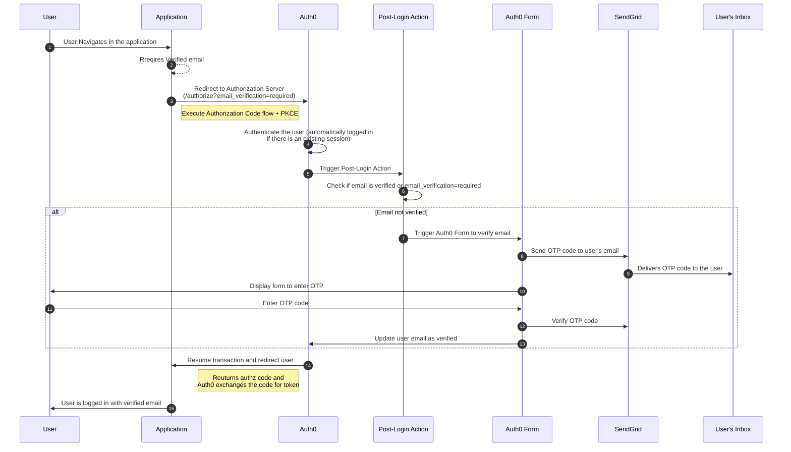

---
Email verification flow via OTP 
---

```mermaid
sequenceDiagram
    autonumber
    participant User
    participant Application 
    participant Auth0
    participant PostLoginAction as Post-Login Action
    participant Auth0Forms as Auth0 Form
    participant SendGrid as SendGrid
    participant Inbox  as User's Inbox
    User ->> Application: User Navigates in the application
    Application -->> Application: Rreqires Verified email  
    Application ->> Auth0: Redirect to Authorization Server <br> (/authorize?email_verification=required)
    note right of Application: Execute Authorization Code flow + PKCE
    Auth0 ->> Auth0: Authenticate the user (automatically logged in <br/> if there is an existing session)
    Auth0 ->> PostLoginAction: Trigger Post-Login Action
    PostLoginAction ->> PostLoginAction: Check if email is verified or email_verification=required
    alt Email not verified
        PostLoginAction ->> Auth0Forms: Trigger Auth0 Form to verify email
        Auth0Forms ->> SendGrid: Send OTP code to user's email
        SendGrid ->> Inbox: Delivers OTP code to the user
        Auth0Forms ->> User: Display form to enter OTP
        User ->> Auth0Forms: Enter OTP code 
        Auth0Forms ->> SendGrid: Verify OTP code
        Auth0Forms ->> Auth0: Update user email as verified 
        
    end
    Auth0 ->> Application: Resume transaction and redirect user
    note left of Auth0 : Reuturns authz code and <br> Auth0 exchanges the code for token
    Application ->> User: User is logged in with verified email

```