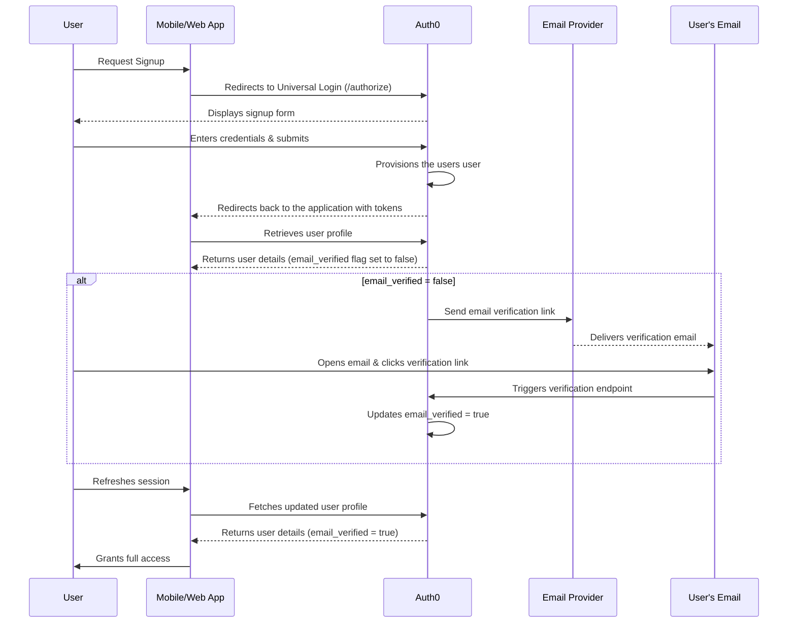

```mermaid
sequenceDiagram
    participant User
    participant Mobile/Web App
    participant Auth0
    participant EmailProvider as Email Provider
    participant User's Email

    User->>Mobile/Web App: Request Signup
    Mobile/Web App->>Auth0: Redirects to Universal Login (/authorize)
    Auth0-->>User: Displays signup form
    User->>Auth0: Enters credentials & submits
    Auth0->>Auth0: Provisions the users user
    Auth0-->>Mobile/Web App: Redirects back to the application with  tokens
    Mobile/Web App->>Auth0: Retrieves user profile
    Auth0-->>Mobile/Web App: Returns user details (email_verified flag set to false)

    alt email_verified = false
        Auth0->>EmailProvider: Send email verification link
        EmailProvider-->>User's Email: Delivers verification email
        User->>User's Email: Opens email & clicks verification link
        User's Email->>Auth0: Triggers verification endpoint
        Auth0->>Auth0: Updates email_verified = true
    end

    User->>Mobile/Web App: Refreshes session
    Mobile/Web App->>Auth0: Fetches updated user profile
    Auth0-->>Mobile/Web App: Returns user details (email_verified = true)
    Mobile/Web App->>User: Grants full access
```