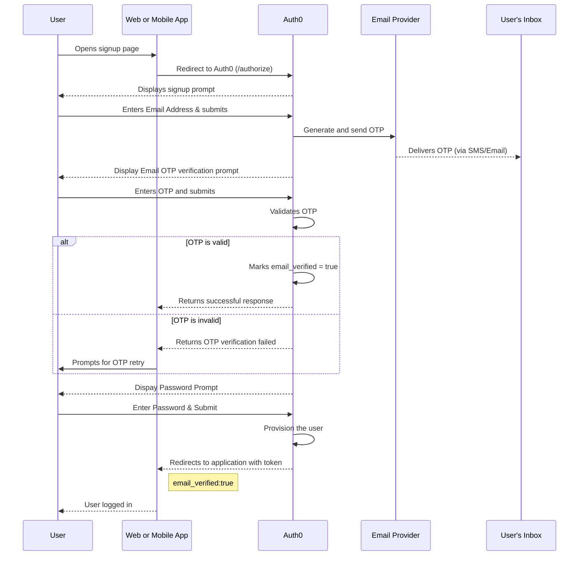

```mermaid
sequenceDiagram
    participant User
    participant App as Web or Mobile App
    participant Auth0
    participant EmailProvider as Email Provider
    participant inbox as User's Inbox

    User->>App: Opens signup page
    App->>Auth0: Redirect to Auth0 (/authorize)
    Auth0-->>User: Displays signup prompt
    User->>Auth0: Enters Email Address & submits
    
    Auth0->>EmailProvider: Generate and send OTP
    EmailProvider-->>inbox: Delivers OTP (via SMS/Email)
    
    Auth0 -->> User : Display Email OTP verification prompt
    User->>Auth0: Enters OTP and submits

    
    Auth0->>Auth0: Validates OTP
    alt OTP is valid
        Auth0->>Auth0: Marks email_verified = true
        Auth0-->>App: Returns successful response
    else OTP is invalid
        Auth0-->>App: Returns OTP verification failed
        App->>User: Prompts for OTP retry
    end

    Auth0 -->>User: Dispay Password Prompt
    User ->> Auth0: Enter Password & Submit
    Auth0 ->> Auth0 : Provision the user
    Auth0 -->> App: Redirects to application with token
    note right of App: email_verified:true
    App -->> User: User logged in 
```