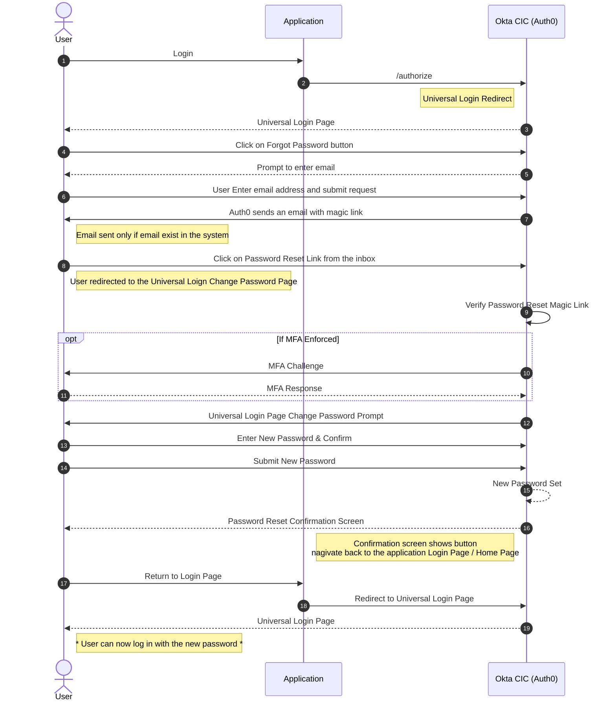
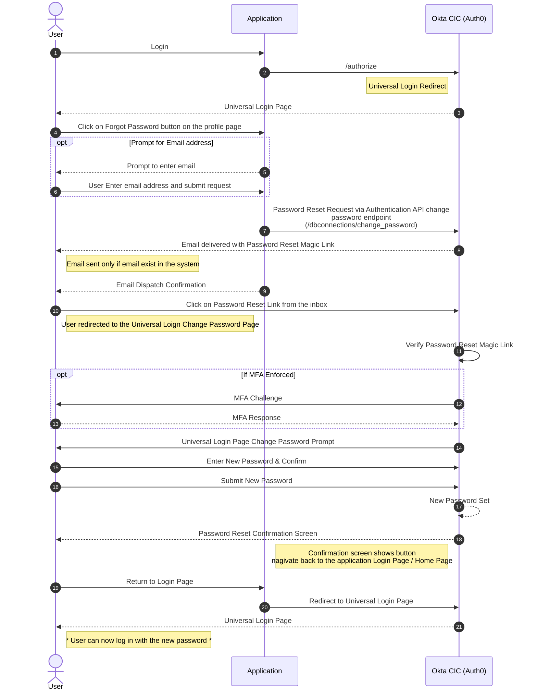
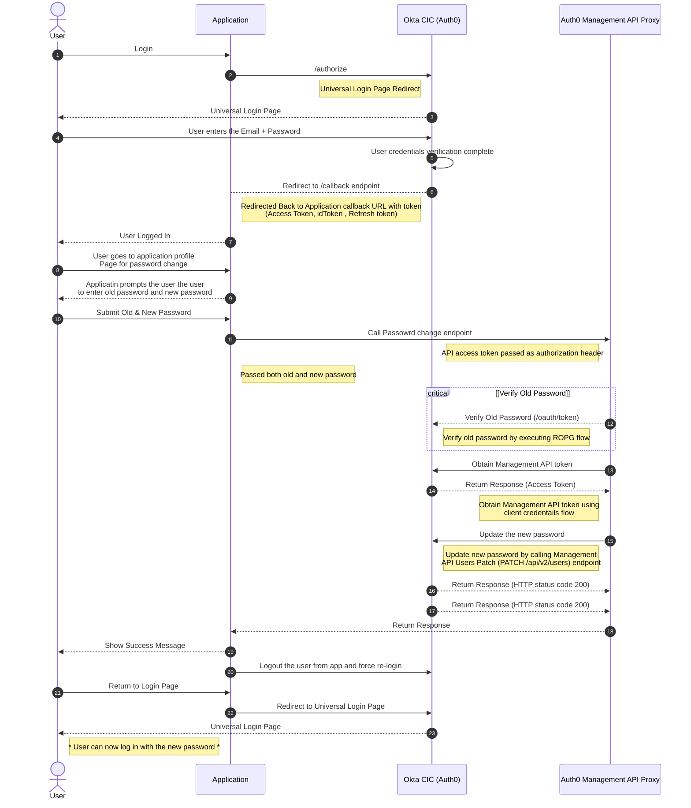

# Auth0 Change User's Passwords
---


### Option 1-  Interactive Reset Flow triggered from Login Screen (Built into the universal login page) 
	
In the Auth0 Universal Login flow, users can initiate a password reset by selecting the "Forgot Password?" link on the login screen. This action triggers a POST request to Auth0 Backend server to initate password reset flow. Upon receiving the request, Auth0 processes the password reset workflow by sending a password reset email to the provided email address. This email contains a secure, time-limited link that allows the user to reset their password. 


* The reset password link in the email is valid for one use only.
* If the user receives multiple password reset emails, only the password link in the most recent email is valid.
* The URL Lifetime field determines how long the link is valid. From the Auth0 dashboard, you can customize the Change Password email and modify the link's lifetime.
* You can extend the password reset flow to include another factor with Auth0 Actions. To learn more, read Password Reset Flow.

The following sequence diagram highlights the flow. 



* User initiates login via the application, which redirects to Auth0 (`/authorize` endpoint).
* Auth0 presents the Universal Login Page, where the user clicks on "Forgot Password?".
* User enters their email and submits the request; Auth0 triggers a password reset process.
* Auth0 sends a password reset email with a magic link, provided the email exists in the system (prevents enumeration attacks).
* User clicks on the password reset link, leading to the Universal Login password reset page.
* Auth0 verifies the magic link and, if MFA is enforced, challenges the user for authentication.
* User completes MFA (if required) and proceeds to set a new password.
* User enters and confirms the new password, and Auth0 updates it in the identity store.
* Auth0 displays a confirmation screen with an option to return to the login page.
* User returns to the application login page, which redirects back to Auth0’s Universal Login.
* User can now log in using their new password. 

**Considerations:**

* This feature is natively integrated into the Auth0 platform, eliminating the need for additional security measures at the application layer.
* Users can reset their password without needing to remember or enter their previous password.
* By default, Auth0 does not send a password change confirmation email. However, this functionality can be implemented using a Post Password Change Action. See [Auth0 Documentation](https://auth0.com/docs/customize/actions/explore-triggers/password-reset-triggers/post-change-password-trigger#invalidate-the-user-s-session-in-another-system) for more details.

### Option 2: Interactive Password Reset Flow via Profile Page using Authentication API Change Password Endpoint

Integrate a password reset option within the application's profile page, eliminating the need for user input since the email can be retrieved from the logged-in session. When triggered, initiate an interactive password reset flow by making a POST request to the Auth0 Authentication API [Change Password endpoint](https://auth0.com/docs/api/authentication#change-password), including the user's email in the request payload. Upon successful execution, Auth0 sends a password reset email to the user, allowing them to set a new password securely.

The follwoing sequence diagram highligts the flow.



* User logs in via the application, which redirects to Auth0 (`/authorize`).
* Auth0 presents the Universal Login Page.
* User initiates password reset from the profile page by clicking "Forgot Password?".
* (Optional) The application prompts the user to enter their email, which is then submitted.
* Application sends a password reset request to the Auth0 Authentication API (`/dbconnections/change_password`).
* Auth0 delivers a password reset email containing a magic link.
* Application confirms email dispatch to the user.
* User clicks the password reset link, which redirects to the Universal Login Change Password Page.
* Auth0 validates the password reset magic link.
* (If MFA is enforced), Auth0 prompts for an MFA challenge, and the user completes it.
* Auth0 presents the password reset form, where the user enters and confirms a new password.
* User submits the new password, and Auth0 updates it in the system.
* Auth0 displays a confirmation screen with a button to return to the application login page.
* User navigates back to the application login page.
* Application redirects back to Auth0’s Universal Login Page.
* User can now log in using their new password.


**Considerations:**
* Functions similarly to Option 1, but initiates the password reset flow directly from the application.
* Eliminates the need for the user to remember or enter their current password.

### Option 3: Self Service Password Reset Flow via Management API (Directly set the new password )

Integrate a password reset form within the profile page, allowing users to directly enter a new password. Use the Auth0 Management API to update the password without requiring a password reset email. 




* Auth0 presents the Universal Login Page, where the user enters their email and password.
* Auth0 verifies user credentials and redirects back to the application's /callback endpoint with authentication tokens (Access Token, ID Token, Refresh Token).
* User is logged into the application.
* User navigates to the profile page to initiate a password change.
* Application prompts the user to enter the old password and a new password.
* User submits the old and new passwords.
* Application calls the Auth0 Management API Proxy, passing the old and new passwords.
* API verifies the old password by calling Auth0’s `/oauth/toke`n endpoint using the [Resource Owner Password Grant (ROPG) flow](https://auth0.com/docs/api/authentication#resource-owner-password-flow).
* API obtains a Management API token using the [Client Credentials flow](https://auth0.com/docs/api/authentication#get-token56).
* API updates the user's password via the Auth0 Management API (PATCH [/api/v2/users](https://auth0.com/docs/api/management/v2/users/patch-users-by-id)).
* Auth0 confirms the password update with an HTTP 200 response.
* API returns the success response to the application.
* Application displays a success message to the user.
* Application logs the user out and forces re-login to ensure session security.
* User is redirected to the Universal Login Page.
* User can now log in using the new password.

**Considerations:** 

* The application must securely collect and transmit both the old and new passwords to prevent security risks.
* Since credentials are handled directly, proper TLS encryption, secure API communication, and logging restrictions must be enforced.
* Unlike Auth0’s built-in reset flow, this approach requires managing API calls, authentication tokens, and security policies.
* The backend must obtain and securely store an API token for updating passwords via the Management API.
* Users must be logged out after a successful password reset to invalidate old session tokens and enforce re-authentication.
* By default, Auth0 does not send a password change confirmation email. However, this functionality can be implemented using a Post Password Change Action. See [Auth0 Documentation](https://auth0.com/docs/customize/actions/explore-triggers/password-reset-triggers/post-change-password-trigger#invalidate-the-user-s-session-in-another-system) for more details.

### Option 4: Change User Passwrod without sending an email or directly setting it from the application

This flow enables users to securely change their password after logging in, without requiring an email-based reset. Instead, it leverages Universal Login, a Post-Login Action, and the Auth0 Management API to handle the password update process within Auth0’s Platform.

The process begins when the user navigates to the profile page and triggers a password change. The application redirects them to Auth0’s Universal Login Page, enforcing re-authentication by passing `prompt=login` and `scope=update:password` in the `/authorize` request.


* User initiates login via the application, which redirects to Auth0 (`/authorize`).
* Auth0 presents the Universal Login Page.
* User navigates to the Profile page and triggers the password change flow.
* Application redirects the user to Auth0’s Universal Login Page (`/authorize`).
    * Includes prompt=login to enforce re-authentication.
    * Passes scope=update:password to initiate the password reset flow.
    * Includes login_hint to pre-fill the user's email.
* Auth0 prompts the user to enter their existing email and password.
* User submits their credentials, and Auth0 validates them.
* (If MFA is enforced), Auth0 challenges the user with an MFA prompt.
* User completes MFA verification (if required).
* Auth0 triggers a Post-Login Action to initiate the password change process.
    * The action obtains a Management API token via the [Client Credentials flow](https://auth0.com/docs/api/authentication#get-token56).
    It then calls the Management API to generate a [Password Change Ticket](https://auth0.com/docs/api/management/v2/tickets/post-password-change).
* Auth0 redirects the user to the Password Change URL.
* User enters a new password in the provided form.
* Auth0 updates the password and confirms the change.
* Auth0 presents a password reset confirmation screen, with an option to return to the application login page.
* User returns to the application login page.
* Application redirects back to Auth0’s Universal Login Page.
* User can now log in using the new password.

**Consideration:** 

* Low security risk, comparable to Option 1 and Option 2, as the password change process is handled entirely within Auth0’s Universal Login.
* No need to send a password reset magic link, as the user directly authenticates and updates their password within the Universal Login experience.
* By default, Auth0 does not send a password change confirmation email. However, this functionality can be implemented using a Post Password Change Action. See [Auth0 Documentation](https://auth0.com/docs/customize/actions/explore-triggers/password-reset-triggers/post-change-password-trigger#invalidate-the-user-s-session-in-another-system) for more details.

**Sample Post Login Action**

```
/**
* Handler that will be called during the execution of a PostLogin flow.
*
* @param {Event} event - Details about the user and the context in which they are logging in.
* @param {PostLoginAPI} api - Interface whose methods can be used to change the behavior of the login.
*/

const auth0Sdk = require("auth0");

exports.onExecutePostLogin = async (event, api) => {

  const ManagementClient = auth0Sdk.ManagementClient;

  // This will make a Management API call
  const managementClientInstance = new ManagementClient({
    // These come from a machine-to-machine application
    domain: 'YOUR_DOMAIN',
    clientId: 'YOUR_CLIENT_ID',
    clientSecret: event.secrets.YOUR_CLIENT_SECRET,
    scope: "create:user_tickets"
  });

/**
* Important Security Consideration: This script MUST check that the 'prompt=login' or 'max_age=0' query 
* parameters were passed into the request to the /authorize endpoint. This mitigates the risk of malicous 
* user agents stripping these query parameters out to bypass re-authentication.
*/
  if(event.transaction?.requested_scopes?.includes('update:password') && 'max_age' in event.request.query){
    try {
      let ticket = await managementClientInstance.createPasswordChangeTicket({
        user_id: event.user.user_id,
        client_id: event.client.client_id
      });
    console.log(ticket);
    api.redirect.sendUserTo(ticket.ticket);
    } catch (err) {
      console.log(err);
    }
  }
};
```
