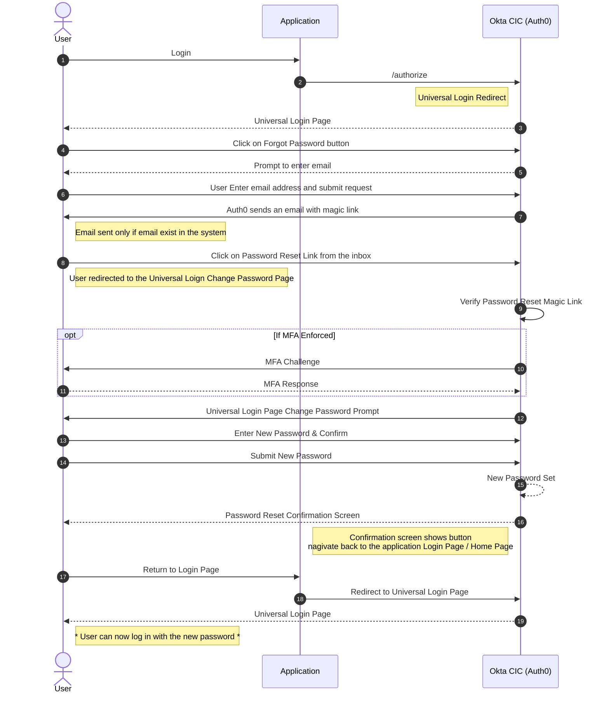
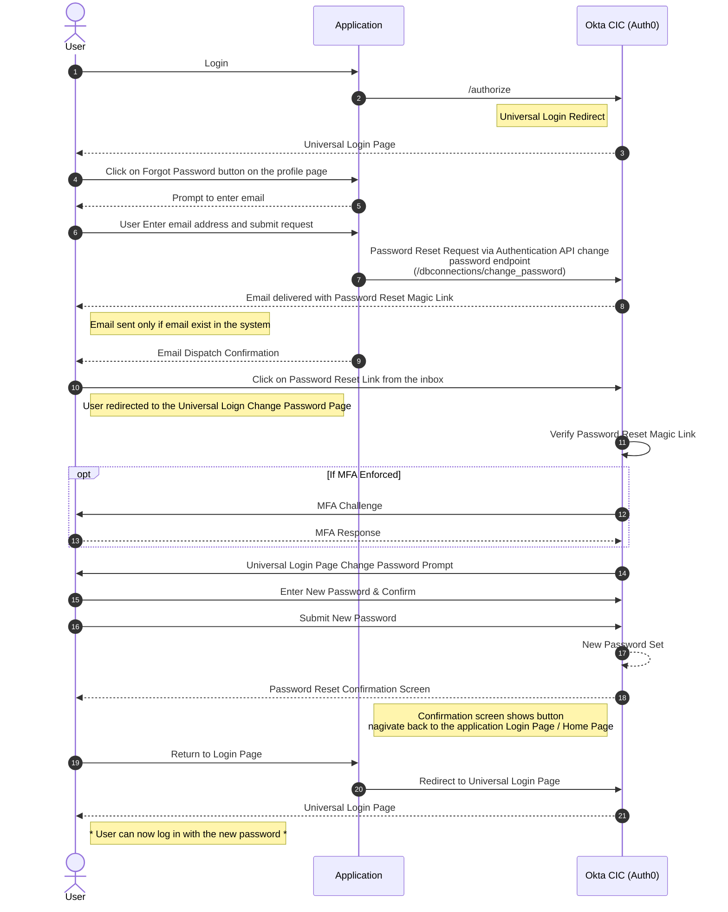
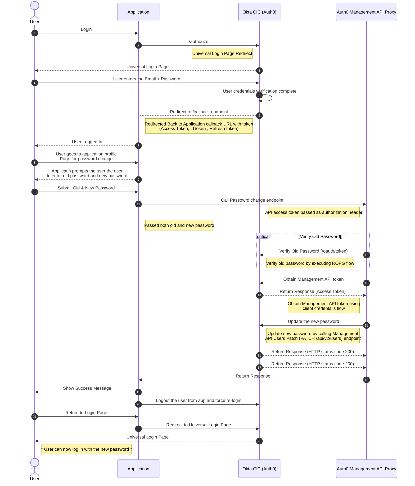
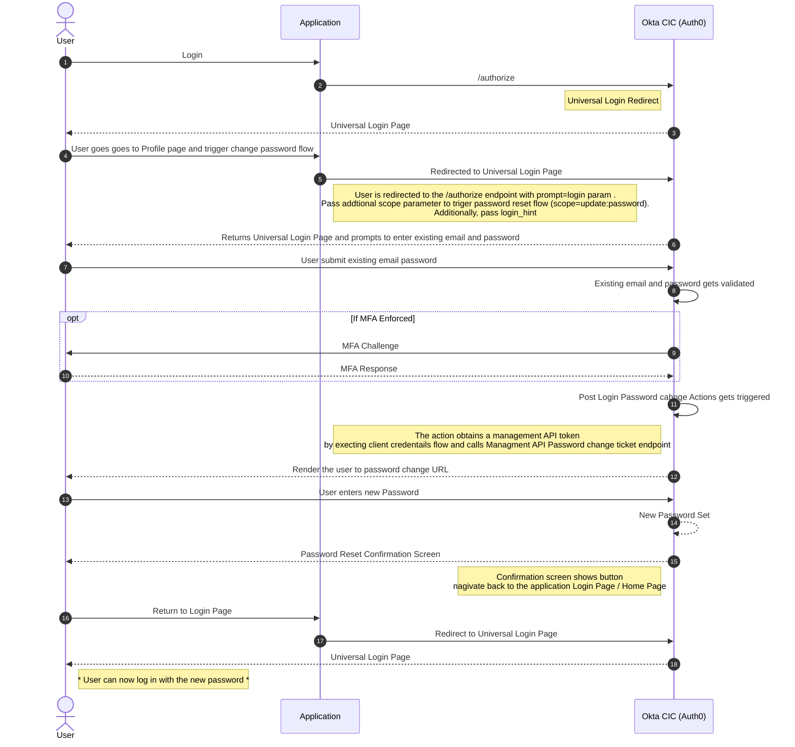

### Option 1-  Interactive Reset Flow triggered from Login Screen (Built into the universal login page) 
	
>The user can click the Don't remember your password link on the Login screen and then enter their email address. This fires off a POST request to Auth0 that triggers the password reset process. The user receives a password reset email.



Considerations: 

* This is feature is built into Auth0 Platfrom. Therefore, does not require any additional secuirty risk in the application layer 
* Does not require user to enter rember old password 

### Option 2: Interactive Password Reset Flow from Profile Page of the application  via Authentication API Change Password Endpoint

> Add an option in the profile page for resetting the password (no inputs are required, as pwd will be set later, and email can be taken from the logged in user). Trigger an interactive password reset flow through the Authentication API, by making a POST call passing the email field. If the call is successful, the user receives a password reset email.


Considerations : 
* Similar to Option 1 but triggers the password reset flow from the application 
* Does not require user to remember the current password 

### Option 3: Self Service Password Reset Flow via Management API (Directly set the new password )
>Add a form in the profile page, which includes the new password field. Directly set the new password via Management API without sending a password reset email.
Optionally, sent an email after the password change via an action Post Change Password Trigger 



Pros & Cons: 

* This features requires application to handle the collection of old and new password. Thefore, application must ensure that the communication is safe between application and backend API. 
* The user must be logged out after successful password reset and force the user to login again 

### Option 4: Change User Passwrod without sending an email or directly setting it from the application

> Today, Auth0 supports two methods of changing a password: (1) the interactive password reset flow or (2) via the Auth0 Management API. In cases whereby Customers have a requirement to offer users the ability to change their password without resetting it via email, a custom Change Password Flow implemented via the API is their only documented solution. This introduces security risk as the application is forced to handle user passwords. Additionally, if the customer requires the user to re-authenticate then this may introduce a dependency on the Resource Owner Password Grant, which is expected to be omitted from the OAuth 2.1 specification. This wiki page describes a method that leverages a Password Change Ticket and an Auth0 Post-Login Action to implement a Custom Change Password flow that first authenticates the user with their existing credentials and then enables them to change their password. Both of those steps are completed directly within Universal Login. 

>This solution relies on Forced Re-authentication, which must be implemented correctly to avoid being bypassed by malicious actors. Specifically, the Relying Party must always validate the auth_time claim within the ID Token. See more. An intentional design consideration of this solution is that the ID token is never returned to the Relying Party. Additionally, the Change Password event is successfully executed before the point at which the ID token would usually be returned to the Relying Party. Therefore, the Post-Login Action must instead implement a check to ensure that the prompt=login or max_age=0 query parameters have been passed into the request to the /authorize endpoint before generating the Password Change Ticket. 



Consideration: 

* Low secuirty risk similar to Option 1 and Option 2. 
* Does not require user sending password reset magic link 

Sample Post Login Action 

```
/**
* Handler that will be called during the execution of a PostLogin flow.
*
* @param {Event} event - Details about the user and the context in which they are logging in.
* @param {PostLoginAPI} api - Interface whose methods can be used to change the behavior of the login.
*/

const auth0Sdk = require("auth0");

exports.onExecutePostLogin = async (event, api) => {

  const ManagementClient = auth0Sdk.ManagementClient;

  // This will make a Management API call
  const managementClientInstance = new ManagementClient({
    // These come from a machine-to-machine application
    domain: 'YOUR_DOMAIN',
    clientId: 'YOUR_CLIENT_ID',
    clientSecret: event.secrets.YOUR_CLIENT_SECRET,
    scope: "create:user_tickets"
  });

/**
* Important Security Consideration: This script MUST check that the 'prompt=login' or 'max_age=0' query 
* parameters were passed into the request to the /authorize endpoint. This mitigates the risk of malicous 
* user agents stripping these query parameters out to bypass re-authentication.
*/
  if(event.transaction?.requested_scopes?.includes('update:password') && 'max_age' in event.request.query){
    try {
      let ticket = await managementClientInstance.createPasswordChangeTicket({
        user_id: event.user.user_id,
        client_id: event.client.client_id
      });
    console.log(ticket);
    api.redirect.sendUserTo(ticket.ticket);
    } catch (err) {
      console.log(err);
    }
  }
};
```