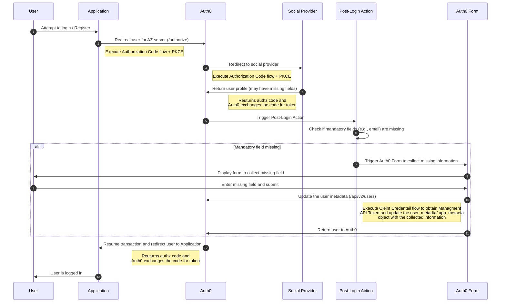

---
Handle missing fields when user login with social provider
---

```mermaid
sequenceDiagram
    autonumber
    participant User
    participant Application
    participant Auth0
    participant SocialProvider as Social Provider
    participant PostLoginAction as Post-Login Action
    participant Auth0Forms as Auth0 Form
    User ->> Application: Attempt to login / Register 
    Application ->> Auth0: Redirect user for AZ server (/authorize)
    note right of Application: Execute Authorization Code flow + PKCE
    Auth0 ->> SocialProvider: Redirect to social provider 
    note right of Auth0: Execute Authorization Code flow + PKCE
    SocialProvider ->> Auth0: Return user profile (may have missing fields)
    note left of SocialProvider : Reuturns authz code and <br> Auth0 exchanges the code for token
    Auth0 ->> PostLoginAction: Trigger Post-Login Action 
    PostLoginAction ->> PostLoginAction: Check if mandatory fields (e.g., email) are missing
    alt Mandatory field missing
        PostLoginAction ->> Auth0Forms: Trigger Auth0 Form to collect missing information
        Auth0Forms ->> User: Display form to collect missing field
        User ->> Auth0Forms: Enter missing field and submit
        Auth0Forms ->> Auth0 : Update the user metadata (/api/v2/users)
        note left of Auth0Forms: Execute Cleint Credentail flow to obtain Managment <br> API Token and update the user_metadta/ app_metaeta <br> object with the collected information
        Auth0Forms ->> Auth0: Return user to Auth0
    end
    Auth0 ->> Application: Resume transaction and redirect user to Application
    note left of Auth0 : Reuturns authz code and <br> Auth0 exchanges the code for token
    Application ->> User: User is logged in
```

