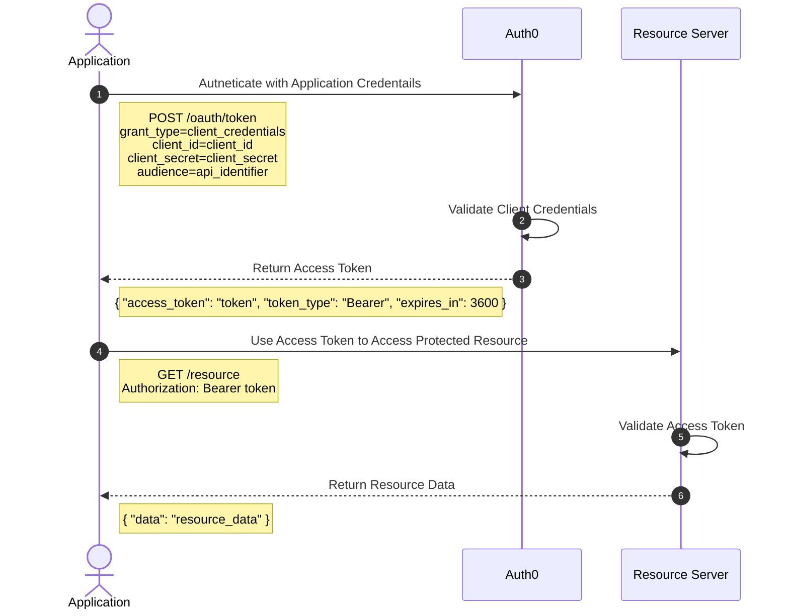

---
Client Credentials Flow
---

```mermaid
sequenceDiagram
  actor a as Application
  participant a0 as Auth0
  participant api as Resource Server
  autonumber

  a ->> a0: Autneticate with Application Credentails 
  note right of a: POST /oauth/token<br/>grant_type=client_credentials<br/>client_id=client_id<br/>client_secret=client_secret<br/>audience=api_identifier

  a0 ->> a0: Validate Client Credentials

  a0 -->> a: Return Access Token
  note right of a: { "access_token": "token", "token_type": "Bearer", "expires_in": 3600 }
  
  a ->> api: Use Access Token to Access Protected Resource
  note right of a: GET /resource<br/>Authorization: Bearer token

  api ->> api: Validate Access Token
  api -->> a: Return Resource Data
  note right of a: { "data": "resource_data" }
```

### Image Link : [Client Credentials Flow](https://github.com/Tanver-Hasan/oauth2.0-flows-/blob/main/images/client_credentails_flow.png)
