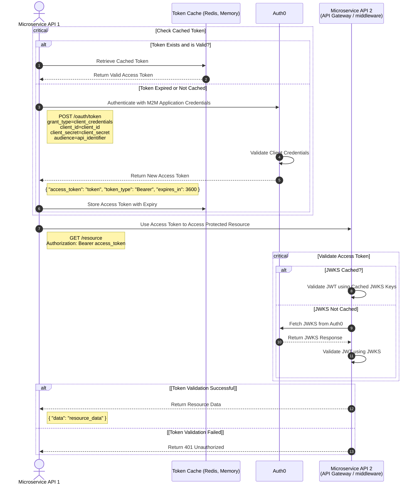

```mermaid
sequenceDiagram
  actor a as Microservice API 1
  participant cache as Token Cache (Redis, Memory)
  participant a0 as Auth0
  participant api as Microservice API 2 <br>(API Gateway / middleware)
  autonumber

  critical Check Cached Token
  alt Token Exists and is Valid?
    a ->> cache: Retrieve Cached Token
    cache -->> a: Return Valid Access Token
  else Token Expired or Not Cached
    a ->> a0: Authenticate with M2M Application Credentials
    note right of a: POST /oauth/token<br/>grant_type=client_credentials<br/>client_id=client_id<br/>client_secret=client_secret<br/>audience=api_identifier

    a0 ->> a0: Validate Client Credentials

    a0 -->> a: Return New Access Token
    note right of a: { "access_token": "token", "token_type": "Bearer", "expires_in": 3600 }

    a ->> cache: Store Access Token with Expiry
  end
  end

  a ->> api: Use Access Token to Access Protected Resource
  note right of a: GET /resource<br/>Authorization: Bearer access_token

  critical Validate Access Token
  alt JWKS Cached?
    api ->> api: Validate JWT using Cached JWKS Keys
  else JWKS Not Cached
    api ->> a0: Fetch JWKS from Auth0
    a0 -->> api: Return JWKS Response
    api ->> api: Validate JWT using JWKS
  end
  end

  alt [Token Validation Successful]
    api -->> a: Return Resource Data
    note right of a: { "data": "resource_data" }
  else [Token Validation Failed]
    api -->> a: Return 401 Unauthorized
  end
```