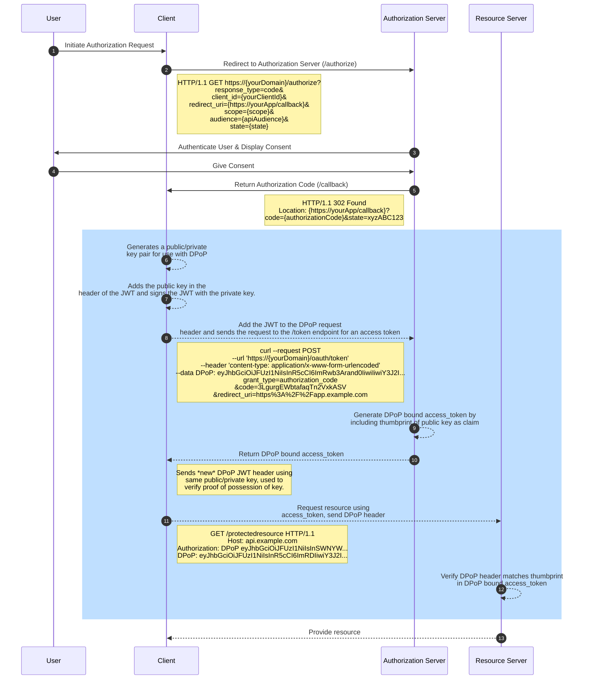

---
Authorization code with Demonstrating Proof of Possession (DPoP) flow
---

```mermaid
sequenceDiagram
  autonumber
  Participant User as User
  Participant Client
  Participant AS as Authorization Server
  Participant RS as Resource Server


    User ->> Client: Initiate Authorization Request 
    Client ->> AS: Redirect to Authorization Server (/authorize)
    note right of Client: HTTP/1.1 GET https://{yourDomain}/authorize? <br/>response_type=code& <br/>client_id={yourClientId}& <br/>redirect_uri={https://yourApp/callback}& <br/>scope={scope}& <br/>audience={apiAudience}&<br/>state={state}
    AS ->> User: Authenticate User & Display Consent
    User ->> AS: Give Consent
    AS ->> Client: Return Authorization Code (/callback)
    note left of AS : HTTP/1.1 302 Found <br/> Location: {https://yourApp/callback}?<br/>code={authorizationCode}&state=xyzABC123
    rect rgb(191, 223, 255)
    Client -->> Client : Generates a public/private <br/> key pair for use with DPoP
    Client -->> Client : Adds the public key in the <br/> header of the JWT and signs the JWT with the private key.
    Client -->> AS : Add the JWT to the DPoP request <br/> header and sends the request to the /token endpoint for an access token
    Note right of Client: curl --request POST  <br/> --url 'https://{yourDomain}/oauth/token'  <br/>--header 'content-type: application/x-www-form-urlencoded'  <br/> --data DPoP: eyJhbGciOiJFUzI1NiIsInR5cCI6ImRwb3Arand0IiwiIiwiY3J2I...  <br/>grant_type=authorization_code <br/>&code=3LgurgEWbtafaqTn2VxkASV <br/>&redirect_uri=https%3A%2F%2Fapp.example.com
    AS -->> AS:  Generate DPoP bound access_token by <br/> including thumbprint of public key as claim
    AS -->> Client:  Return DPoP bound access_token
    Note right of Client: Sends *new* DPoP JWT header using <br/> same public/private key, used to <br/> verify proof of possession of key.
    Client -->> RS:  Request resource using <br/> access_token, send DPoP header
    Note right of Client : GET /protectedresource HTTP/1.1 <br/>Host: api.example.com <br/>Authorization: DPoP eyJhbGciOiJFUzI1NiIsInSWNYW...<br/>DPoP: eyJhbGciOiJFUzI1NiIsInR5cCI6ImRDIiwiY3J2I...

    RS -->> RS:  Verify DPoP header matches thumbprint <br/> in DPoP bound access_token
    end
    RS -->> Client:  Provide resource
```
