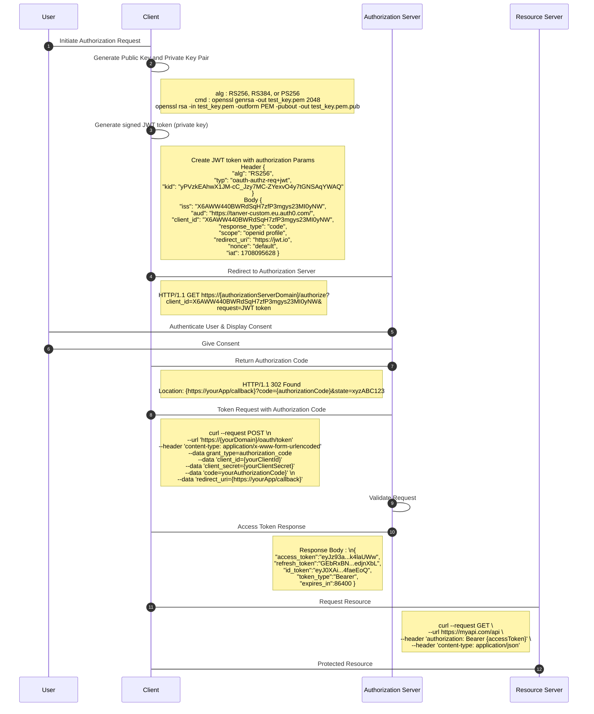

---
Authorization Code Flow with JWT-Secured Authorization Requests (JAR)
---

```mermaid
sequenceDiagram
    autonumber
    participant User
    participant Client
    participant AuthorizationServer AS Authorization Server
    participant ResourceServer as Resource Server

    User -> Client: Initiate Authorization Request 
    Client -> Client : Generate Public Key and Private Key Pair
    note right of Client: <br/> alg : RS256, RS384, or PS256 <br/>cmd : openssl genrsa -out test_key.pem 2048 <br/> openssl rsa -in test_key.pem -outform PEM -pubout -out test_key.pem.pub
    Client -> Client : Generate signed JWT token (private key) 
    note right of Client: <br/> Create JWT token with authorization Params<br/> Header { <br/> "alg": "RS256", <br/>"typ": "oauth-authz-req+jwt", <br/>"kid": "yPVzkEAhwX1JM-cC_Jzy7MC-ZYexvO4y7tGNSAqYWAQ"<br/> }<br/> Body {<br/> "iss": "X6AWW440BWRdSqH7zfP3mgys23MI0yNW", <br/>"aud": "https://tanver-custom.eu.auth0.com/", <br/>"client_id": "X6AWW440BWRdSqH7zfP3mgys23MI0yNW",<br/>"response_type": "code", <br/> "scope": "openid profile",<br/> "redirect_uri": "https://jwt.io", <br/> "nonce": "default",<br/> "iat": 1708095628 }
    Client -> AuthorizationServer: Redirect to Authorization Server
    note right of Client:  <br/>HTTP/1.1 GET https://[authorizationServerDomain]/authorize?  <br/> client_id=X6AWW440BWRdSqH7zfP3mgys23MI0yNW& <br/> request=JWT token
    AuthorizationServer -> User: Authenticate User & Display Consent
    User -> AuthorizationServer: Give Consent
    AuthorizationServer -> Client: Return Authorization Code 
    note left of AuthorizationServer:  <br/>HTTP/1.1 302 Found <br/> Location: {https://yourApp/callback}?code={authorizationCode}&state=xyzABC123

    Client -> AuthorizationServer: Token Request with  Authorization Code
    note right of Client: <br/> curl --request POST \n <br/> --url 'https://{yourDomain}/oauth/token'  <br/> --header 'content-type: application/x-www-form-urlencoded'  <br/> --data grant_type=authorization_code <br/> --data 'client_id={yourClientId}' <br/> --data 'client_secret={yourClientSecret}' <br/> --data 'code=yourAuthorizationCode}' \n <br/> --data 'redirect_uri={https://yourApp/callback}'

    AuthorizationServer -> AuthorizationServer: Validate Request
    AuthorizationServer -> Client: Access Token Response
    note left of AuthorizationServer:  <br/> Response Body : \n{  <br/> "access_token":"eyJz93a...k4laUWw", <br/> "refresh_token":"GEbRxBN...edjnXbL", <br/> "id_token":"eyJ0XAi...4faeEoQ", <br/> "token_type":"Bearer", <br/> "expires_in":86400 }
    Client -> ResourceServer: Request Resource 
    note left of ResourceServer:  <br/> curl --request GET \ <br/> --url https://myapi.com/api \ <br/> --header 'authorization: Bearer {accessToken}' \ <br/> --header 'content-type: application/json'
    ResourceServer -> Client: Protected Resource
```
