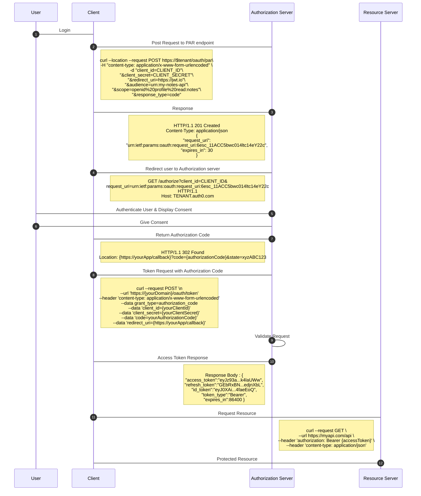

---
Authorization Code Flow with Pushed Authorization Requests (PAR)
---

```mermaid 

sequenceDiagram
    autonumber

    participant User
    participant Client
    participant AuthorizationServer as Authorization Server
    participant ResourceServer as Resource Server

    User -> Client: Login
    Client -> AuthorizationServer: Post Request to PAR endpoint
    note right of Client: <br/> curl --location --request POST https://$tenant/oauth/par\ <br/>-H "content-type: application/x-www-form-urlencoded" \ <br/>-d "client_id=CLIENT_ID"\ <br/> "&client_secret=CLIENT_SECRET"\ <br/> "&redirect_uri=https://jwt.io"\ <br/>"&audience=urn:my-notes-api"\ <br/> "&scope=openid%20profile%20read:notes"\<br/> "&response_type=code"
    AuthorizationServer -> Client : Response 
    note left of AuthorizationServer: <br/> HTTP/1.1 201 Created  <br/>  Content-Type: application/json <br/> { <br/> "request_uri": <br/>     "urn:ietf:params:oauth:request_uri:6esc_11ACC5bwc014ltc14eY22c", <br/> "expires_in": 30 <br/> }
    Client -> AuthorizationServer : Redirect user to  Authorization server
    note left of AuthorizationServer: GET /authorize?client_id=CLIENT_ID&<br/>request_uri=urn:ietf:params:oauth:request_uri:6esc_11ACC5bwc014ltc14eY22c  <br/> HTTP/1.1  <br/> Host: TENANT.auth0.com
    AuthorizationServer -> User: Authenticate User & Display Consent
    User -> AuthorizationServer: Give Consent
    AuthorizationServer -> Client: Return Authorization Code 
    note left of AuthorizationServer: <br/> HTTP/1.1 302 Found  <br/>Location: {https://yourApp/callback}?code={authorizationCode}&state=xyzABC123
    Client -> AuthorizationServer: Token Request with  Authorization Code
    note right of Client: <br/> curl --request POST \n <br/> --url 'https://{yourDomain}/oauth/token'  <br/> --header 'content-type: application/x-www-form-urlencoded' <br/> --data grant_type=authorization_code  <br/> --data 'client_id={yourClientId}'  <br/> --data 'client_secret={yourClientSecret}' <br/> --data 'code=yourAuthorizationCode}' <br/> --data 'redirect_uri={https://yourApp/callback}'
    AuthorizationServer -> AuthorizationServer: Validate Request
    AuthorizationServer -> Client: Access Token Response
    note left of AuthorizationServer: <br/>   Response Body : { <br/>  "access_token":"eyJz93a...k4laUWw", <br/>  "refresh_token":"GEbRxBN...edjnXbL", <br/>  "id_token":"eyJ0XAi...4faeEoQ", <br/>  "token_type":"Bearer",<br/>   "expires_in":86400 }
    Client -> ResourceServer: Request Resource 
    note left of ResourceServer: <br/> curl --request GET \ <br/> --url https://myapi.com/api \  <br/> --header 'authorization: Bearer {accessToken}' \ <br/> --header 'content-type: application/json'
    ResourceServer -> Client: Protected Resource
```
