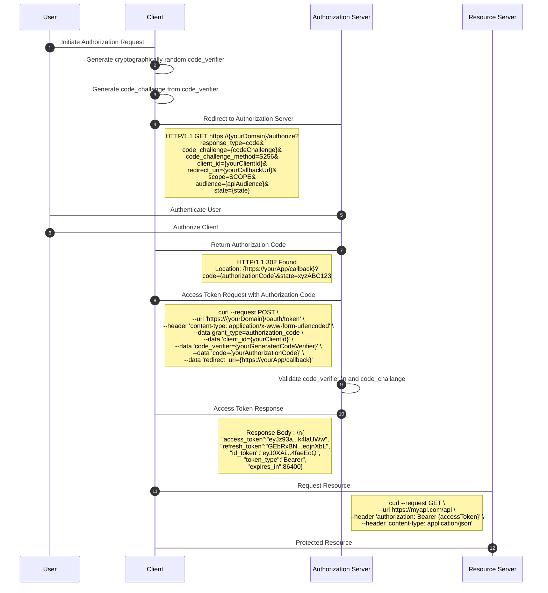

---
Authorization Code flow 
---

```mermaid

sequenceDiagram
    autonumber
    participant User
    participant Client
    participant AuthorizationServer as Authorization Server
    participant ResourceServer as Resource Server

    User -> Client: Initiate Authorization Request 
    Client -> Client: Generate cryptographically random code_verifier 
    Client -> Client: Generate code_challenge  from code_verifier
    Client -> AuthorizationServer: Redirect to Authorization Server
    note right of Client: HTTP/1.1 GET https://{yourDomain}/authorize? <br/> response_type=code& <br/>code_challenge={codeChallenge}& <br/> code_challenge_method=S256& <br/> client_id={yourClientId}& <br/> redirect_uri={yourCallbackUrl}&  <br/> scope=SCOPE& <br/> audience={apiAudience}& <br/> state={state}      
    AuthorizationServer -> User: Authenticate User
    User -> AuthorizationServer: Authorize Client
    AuthorizationServer -> Client: Return Authorization Code 
    note left of AuthorizationServer:  HTTP/1.1 302 Found <br/> Location: {https://yourApp/callback}?<br/>code={authorizationCode}&state=xyzABC123
    Client -> AuthorizationServer: Access Token Request with  Authorization Code
    note right of Client: curl --request POST \ <br/> --url 'https://{yourDomain}/oauth/token' \<br/> --header 'content-type: application/x-www-form-urlencoded' \ <br/> --data grant_type=authorization_code \<br/>--data 'client_id={yourClientId}' \ <br/> --data 'code_verifier={yourGeneratedCodeVerifier}' \<br/> --data 'code={yourAuthorizationCode}' \<br/> --data 'redirect_uri={https://yourApp/callback}'
    AuthorizationServer -> AuthorizationServer: Validate  code_verifier \n and  code_challange
    AuthorizationServer -> Client: Access Token Response
    note left of AuthorizationServer:  <br/>  Response Body : \n{ <br/> "access_token":"eyJz93a...k4laUWw", <br/> "refresh_token":"GEbRxBN...edjnXbL", <br/> "id_token":"eyJ0XAi...4faeEoQ", <br/> "token_type":"Bearer",<br/> "expires_in":86400}
    Client -> ResourceServer: Request Resource 
    note left of ResourceServer: curl --request GET \<br/>  --url https://myapi.com/api \ <br/> --header 'authorization: Bearer {accessToken}' \ <br/> --header 'content-type: application/json'
    ResourceServer -> Client: Protected Resource
```
        
        
