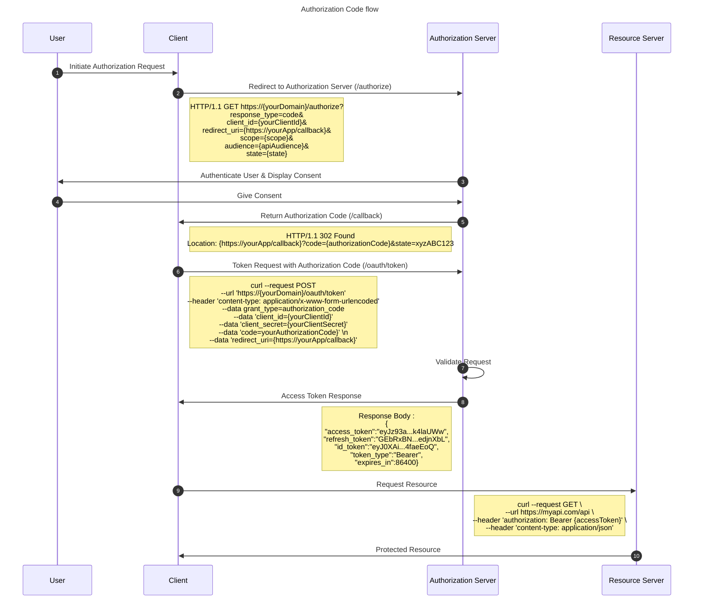

```mermaid
---
title: Authorization Code flow
---

sequenceDiagram
    autonumber
    participant User
    participant Client
    participant AuthorizationServer as Authorization Server
    participant ResourceServer as Resource Server
    autonumber
    User ->> Client: Initiate Authorization Request 
    Client ->> AuthorizationServer: Redirect to Authorization Server (/authorize)
    note right of Client: HTTP/1.1 GET https://{yourDomain}/authorize? <br/>response_type=code& <br/>client_id={yourClientId}& <br/>redirect_uri={https://yourApp/callback}& <br/>scope={scope}& <br/>audience={apiAudience}&<br/>state={state}
    AuthorizationServer ->> User: Authenticate User & Display Consent
    User ->> AuthorizationServer: Give Consent
    AuthorizationServer ->> Client: Return Authorization Code (/callback)
    note left of AuthorizationServer : HTTP/1.1 302 Found <br/> Location: {https://yourApp/callback}?code={authorizationCode}&state=xyzABC123
    Client ->> AuthorizationServer: Token Request with  Authorization Code (/oauth/token)
    note right of Client : curl --request POST  <br/>--url 'https://{yourDomain}/oauth/token'  <br/>--header 'content-type: application/x-www-form-urlencoded'  <br/>--data grant_type=authorization_code <br/>--data 'client_id={yourClientId}'  <br/>--data 'client_secret={yourClientSecret}'  <br/>--data 'code=yourAuthorizationCode}' \n<br/>--data 'redirect_uri={https://yourApp/callback}'
    AuthorizationServer ->> AuthorizationServer: Validate Request
    AuthorizationServer ->> Client: Access Token Response
    note left of AuthorizationServer:  Response Body : <br/>{ <br/> "access_token":"eyJz93a...k4laUWw", <br/> "refresh_token":"GEbRxBN...edjnXbL", <br/> "id_token":"eyJ0XAi...4faeEoQ", <br/> "token_type":"Bearer", <br/> "expires_in":86400} 
    Client ->> ResourceServer: Request Resource 
    note left of ResourceServer:  curl --request GET \ <br/>--url https://myapi.com/api \ <br/>--header 'authorization: Bearer {accessToken}' \ <br/>--header 'content-type: application/json'
    ResourceServer ->> Client: Protected Resource
```
