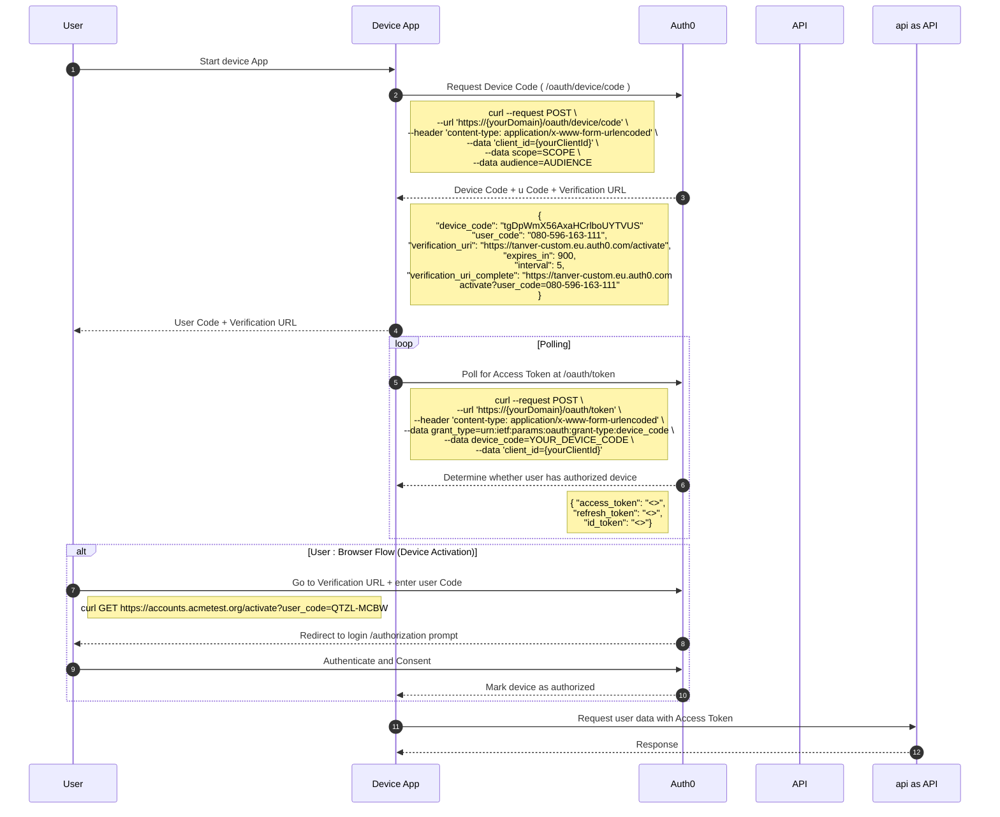

```mermaid 

sequenceDiagram
    autonumber
    participant u as User
    participant da as Device App
    participant a0 as Auth0
    participant api as API

    u ->> da: Start device App
    da ->> a0: Request Device Code ( /oauth/device/code ) 
    note right of da : curl --request POST \ <br/> --url 'https://{yourDomain}/oauth/device/code' \<br/> --header 'content-type: application/x-www-form-urlencoded' \<br/> --data 'client_id={yourClientId}' \<br/> --data scope=SCOPE \<br/> --data audience=AUDIENCE
    a0 -->> da: Device Code + u Code + Verification URL
    note left of a0: { <br/> "device_code": "tgDpWmX56AxaHCrlboUYTVUS" <br/>"user_code": "080-596-163-111",<br/> "verification_uri": "https://tanver-custom.eu.auth0.com/activate",<br/>"expires_in": 900,<br/> "interval": 5,<br/>"verification_uri_complete": "https://tanver-custom.eu.auth0.com<br/>activate?user_code=080-596-163-111"<br/>}
    da -->> u:  User Code + Verification URL

    loop Polling
        da ->> a0: Poll for Access Token at /oauth/token
        note right of da: curl --request POST \<br/>--url 'https://{yourDomain}/oauth/token' \<br/>--header 'content-type: application/x-www-form-urlencoded' \<br/>--data grant_type=urn:ietf:params:oauth:grant-type:device_code \<br/> --data device_code=YOUR_DEVICE_CODE \<br/>--data 'client_id={yourClientId}'
        a0 -->> da: Determine whether user has authorized device
        note left of a0:  { "access_token": "<>",<br/>"refresh_token": "<>",<br/>"id_token": "<>"}
    end

    alt User : Browser Flow (Device Activation)
    u ->> a0: Go to Verification URL + enter user Code
    note right of u: curl GET https://accounts.acmetest.org/activate?user_code=QTZL-MCBW
    a0 -->> u: Redirect to login /authorization prompt
    u ->> a0: Authenticate and Consent
    a0 -->> da: Mark device as authorized
    end


    da ->> api as API: Request user data with Access Token
    api as API -->> da: Response
```