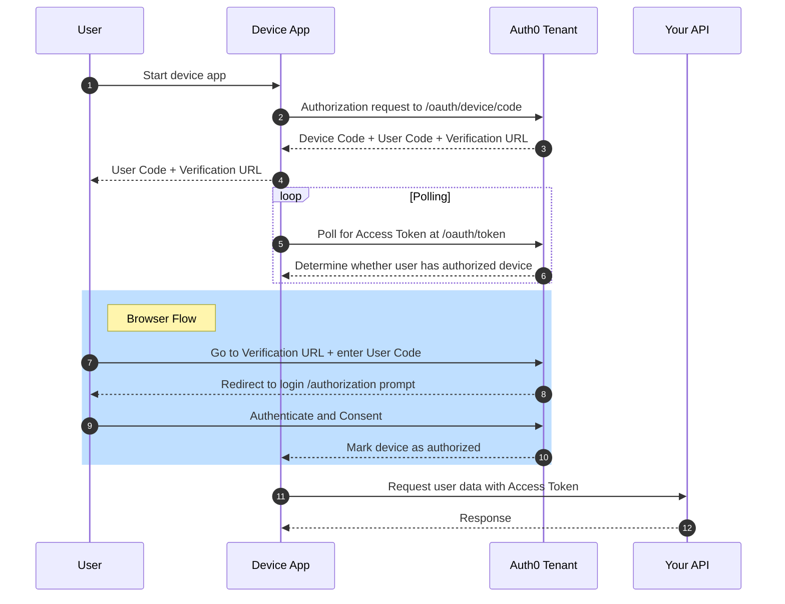

```mermaid 

sequenceDiagram
    autonumber
    participant User
    participant Device App
    participant Auth0 Tenant
    participant Your API

    User ->> Device App: Start device app
    Device App ->> Auth0 Tenant: Authorization request to /oauth/device/code
    Auth0 Tenant -->> Device App: Device Code + User Code + Verification URL
    Device App -->> User: User Code + Verification URL
    loop Polling
        Device App ->> Auth0 Tenant: Poll for Access Token at /oauth/token
        Auth0 Tenant -->> Device App: Determine whether user has authorized device
    end
    rect rgb(191, 223, 255)
    note right of User: Browser Flow
    User ->> Auth0 Tenant: Go to Verification URL + enter User Code
    Auth0 Tenant -->> User: Redirect to login /authorization prompt
    User ->> Auth0 Tenant: Authenticate and Consent
    Auth0 Tenant -->> Device App: Mark device as authorized
    end


    Device App ->> Your API: Request user data with Access Token
    Your API -->> Device App: Response
```