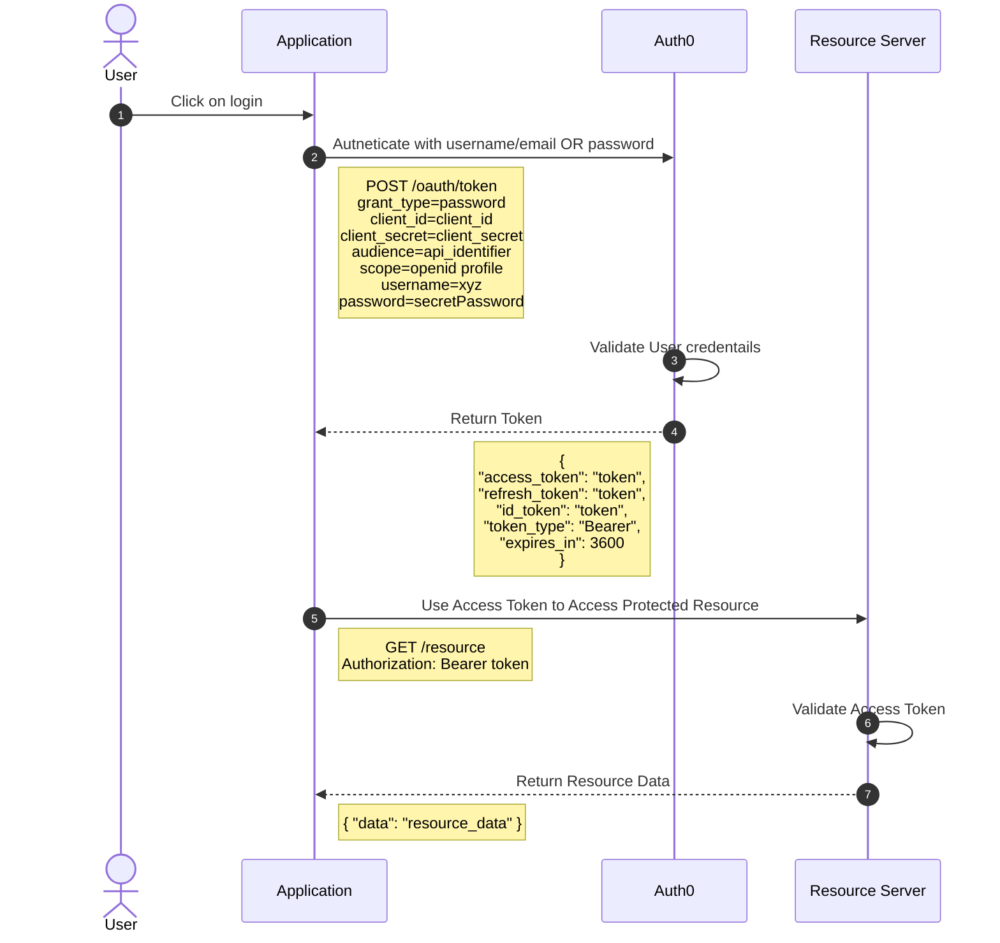

---
Resource Owner Password Grant type
---

```mermaid

sequenceDiagram
  actor u as User
  participant a as Application
  participant a0 as Auth0
  participant api as Resource Server
  autonumber
  u ->> a : Click on login
  a ->> a0: Autneticate with username/email OR password
  note right of a: POST /oauth/token<br/>grant_type=password<br/>client_id=client_id<br/>client_secret=client_secret<br/>audience=api_identifier<br/>scope=openid profile<br/>username=xyz<br/>password=secretPassword

  a0 ->> a0: Validate User credentails 

  a0 -->> a: Return  Token
  note left of a0: { <br/> "access_token": "token", <br/>"refresh_token": "token",<br/> "id_token": "token",<br/> "token_type": "Bearer", <br/>"expires_in": 3600 <br/>}
  
  a ->> api: Use Access Token to Access Protected Resource
  note right of a: GET /resource<br/>Authorization: Bearer token

  api ->> api: Validate Access Token
  api -->> a: Return Resource Data
  note right of a: { "data": "resource_data" }
```

